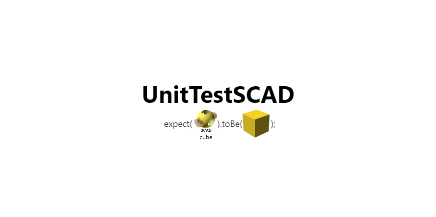

# UnitTestSCAD

 [](https://www.npmjs.com/package/unittestscad) [](https://codeclimate.com/github/HopefulLlama/UnitTestSCAD) [](https://gitter.im/UnitTestSCAD/Lobby?utm_source=badge&utm_medium=badge&utm_campaign=pr-badge&utm_content=badge)



# Unit Testing for OpenSCAD

UnitTestSCAD brings forth unit testing capabilities to OpenSCAD. Unit testing enables you to check for regressions, accuracy and robustness of code in a fast, repeatable manner. Speed of development increases as unit tests will worry about your regressions, and allow you to plow ahead with your vision.

# Contents
- [Getting Started](#getting-started)
- [Usage](#usage)
- [API Reference](#api-reference)

# Getting Started
## Installing OpenSCAD
UnitTestSCAD has a very strong dependency on OpenSCAD. This is because UnitTestSCAD uses some of the features from OpenSCAD to perform some of its underlying testing.

Simply start by installing OpenSCAD if you have not done so already:

[OpenSCAD Home](http://www.openscad.org/)

## Adding OpenSCAD to PATH
In order for UnitTestSCAD to take advantage of OpenSCAD's features, the folder which contains the OpenSCAD files must be added to the PATH environment variable on your machine.

While the path will generally be the same on all platforms (Windows, Linux, Mac), the file they point to specifically is different. If you have moved the respective file manually, you will need to point at:
- Windows: `openscad.com`
- Linux: `openscad.exe`
- Mac: `openscad.exe`

These files will be in the location where you installed OpenSCAD. For example, by default on Windows: `C:/Program Files/OpenSCAD`.

Note: **The path to the folder containing the files is to be added to the PATH environment variable.**

## Installing NodeJS and NPM
UnitTestSCAD is powered by NodeJS and distributed by NPM. They are distributed together and complement each other well.
Follow the installation from the NodeJS website if you do not have these installed:

[NodeJS Home](https://nodejs.org/en/)

## Installing UnitTestSCAD
If all has gone well, then installing UnitTestSCAD will be a simple command to run in the command line/terminal.

To install UnitTestSCAD, run the command:

`npm i unittestscad`

# Usage
UnitTestSCAD should be required as standard into a NodeJS script.

```javascript
const UnitTestSCAD = require('unittestscad');
```

`UnitTestSCAD` exposes several classes designed at enabling assertions on your `.scad` functions and modules. For example, to assert against a `.scad` file which produces a cube (`cube.scad`), you can create it as such:

```javascript
const cube = new UnitTestSCAD.ThreeDModule({
  include: 'cube.scad'
});

cube.height === 5;
```

# API Reference
See [API Documentation](https://hopefulllama.github.io/UnitTestSCAD/) for more details.